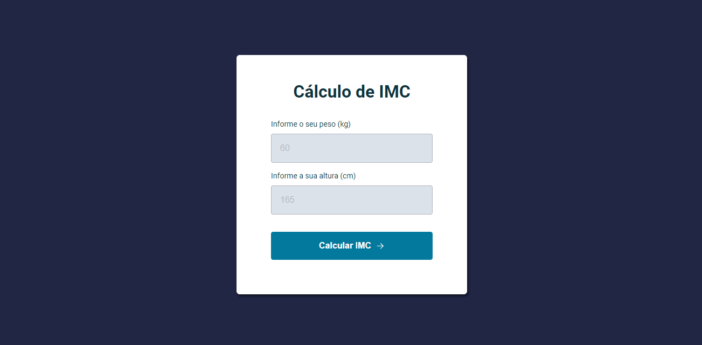

# Projeto 08 | Programa Explorer da Rocketseat

- Desafio: criar uma calculadora de IMC.

[🔗 Clique aqui para acessar](https://alineviana.github.io/calculando-imc/)

 

> ## 📝 Conceitos estudados
 

- HTML e CSS
- Aplicação de estilos ao formulário
- Modal (caixa de diálogo/janela pop-up)
- Alerta de erro
- Evento de submit
- Estruturando dados do Modal
- ES6 Modules
- Modularização do Modal popup
- Validação dados
- Modularização alerta de erro
- Modularização das funções utilitárias
- Refatoração e aplicação de regras Clean Code

 

> ## 🖥️ Tecnologias

 

- HTML5  
- CSS3
- JavaScript

 

